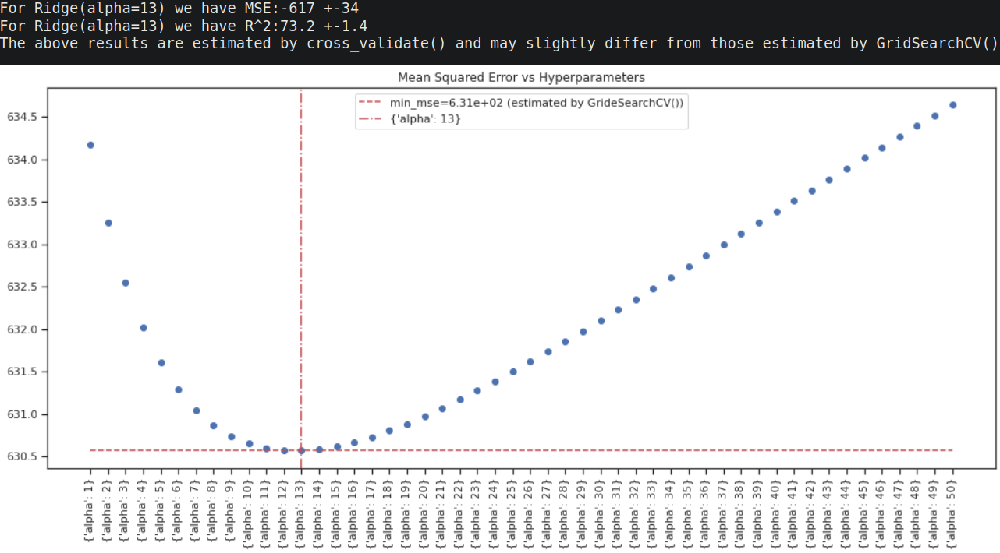
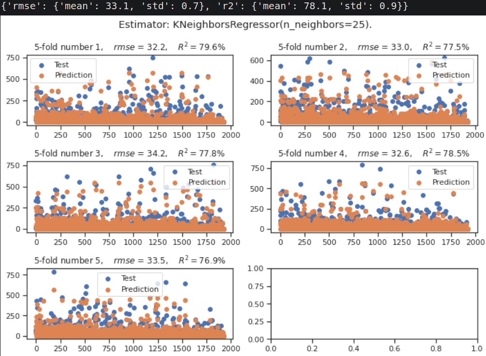
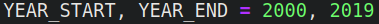

# Movie Genre
Study providing some insights on the influence of genres (Comedy, Action...) on the film 
revenues.
The project is available [HERE](1_scripts/2_descriptiveStats.ipynb)

## Table of contents
* [1 Introduction](#1_introduction)
* [2 Technologies](#2_technologies)
* [3 Features](#3_features)
* [4 Updating original file](#4_updating)

## 1 Introduction <a id="1_introduction"></a>
We know that the revenues generated by a film depend on the Budget, on the writers, on the
actors but also on the genre.</br>
It is this last point that I decided to investigate, that is quantifying the influence of
a given genre movie on its revenues at the Box Office.</br>
A few time ago when I wondered if the genre associated with a film has had any influence
on the money generated by this film, so I decided to make to make my own investigation. 

## 2 Technologies <a id="2_technologies"></a>
- python 3.8.5
- bs4 4.9.3
- conda 4.9.2
- matplotlib 3.3.2
- pandas 1.1.3
- requests 2.24.0
- scrapy 2.4.0
- sklearn-contrib-lightning 0.5.0
- seaborn 0.11.0
- statsmodels 0.12.0


## 3 Features <a id="3_features"></a>
- [build_dict_currency](1_scripts/preprocessingFunctions.py#L108)
that retrieve the exchange rate for a range period from 2000 to 2019. 
- [find_bestHyperparameters()](1_scripts/analyticalFunctions.py#L270)
allows to identify the best hyper-parameters for a given regression estimator and provide
a graphical visualization:

- Evaluate MSE (Mean Squared Error) with option to use power transformation or applying
a function to the response to estimate the MSE.
- [compute_rmse_r2()](1_scripts/analyticalFunctions.py#L739) allows to
assess the predictability power of a regression estimator, it can takes in argument a 
function to apply to the response in order to compute the MSE. This last point can be very
useful to assess the predictive power of a function of which the response have been
transformed, for instance by the log function.

 and apply a function to the response to get MSE value in the desired form. 
- [find_bestModel_fwd_bwd()](1_scripts/analyticalFunctions.py#L505)
allows to perform forward or backward stepwise selection, the particularity of this 
function is at each step namely adding (forward) or removing (backward) variables the 
function apply a dummy coding of the categorical variables.

The 2 last functions can use power transformation as [Box-Cox](https://en.wikipedia.org/wiki/Power_transform#Box%E2%80%93Cox_transformation) to any numerical variable,

### To do:
- To extend the selection criterion at all available regression scores of ScikitLearn.


##  4 Updating original file <a id="4_updating"></a>
If you are not interested in making study on the influence of the genre movie on a period
ahead from 2000-2019, skip this part.

If you pursue in this part, then you are interested in making study on movie having their 
release year earlier than 2000 after 2019.</br>
To begin we will download the file containing the reference of all movies of which there 
are information in IMDb. After that we will retrieve all the information concerning the 
 in the given range period. Currently this retrieval take long time, for a 
background of 20 years it needs 13 hours, so think about it if you want to pursue this
step.</br>
Nonetheless the algorithm works very well and use scrapy, that is versatile and deals well
with  avoid user chart of the web site on which we wish to perform a data retrieval.

### For Windows  
Download the files of this repository.</br>
Download  [title.basics.tsv.gz](#https://datasets.imdbws.com/title.basics.tsv.gz) 
and rename it "0_title.basics.tsv.gz" then unzip this file provided by IMDb. </br>
Finally place it in the MostValuableGenreMovie/2_data/1_original/ folder.

### For Linux
```shell
git clone https://github.com/rgb250/MostValuableGenreMovie/
cd MostValuableGenreMovie/
curl -# -o 2_data/1_original/0_title.basics.tsv.gz https://datasets.imdbws.com/title.basics.tsv.gz
gzip -dv 2_data/1_original/0_title.basics.tsv.gz
```

### conda (for all users)
Create your virtual environment with your beloved package manager: pip or anaconda (or 
miniconda) ...
For me it will be miniconda in this example.</br>
Open the conda console and place you at the root of your MostValuableGenreMovie folder. 

``` shell
conda update conda                   # update conda manager.
conda create -n myenv scrapy=2.4.0   # create environment if you do not have create one yet.
conda activate environment           # activate environment
cd 1_scripts/dataMovieRetrievial/    # change directory
scrapy crawl environment             # launch the data retrieval with scrapy.
```

Now you can enjoy the study, and make your own on the period of your choice.
Note that the observation in my notebooks are only valid on the period of time that I 
initially took in the script [Preprocessing notebook](1_scripts/1_preprocessing.ipynb).

